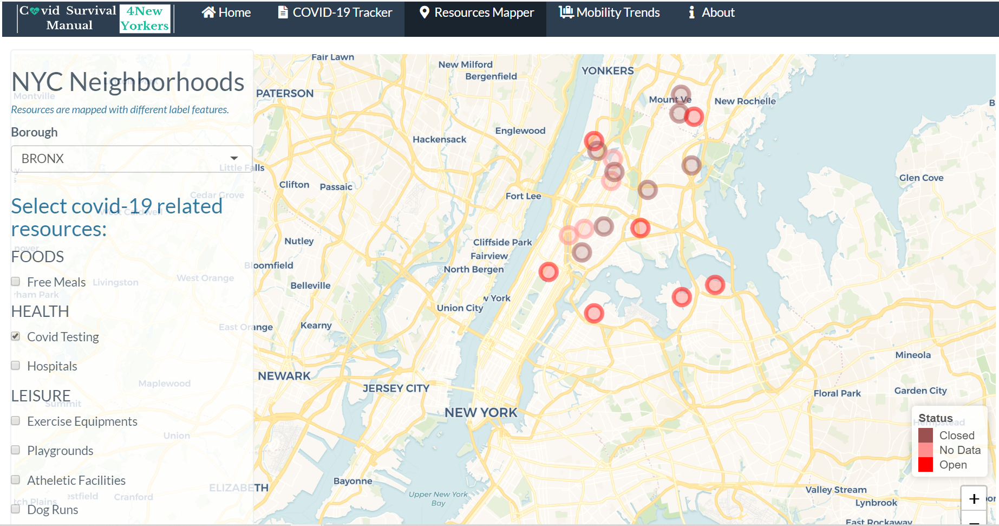

# Project 2: Shiny App Development - 4New Yorkers Covid Survival Manual

### [Project Description](doc/project2_desc.md)



## Project Title: 4New Yorkers Covid Survival Manual
Term: Spring 2021

+ Team #5
+ Team members
	+ Aurore Gosmant (UNI: apg2170)
	+ Yibai Liu (UNI: yl4616)
	+ Olha Maslova (UNI: om2308)
	+ Zikun Zhuang (UNI: zz2762)

+ **Project summary**: 

The Coronavirus (Covid-19) has so far infected over 100 million people and caused over 2 million deaths globally. Covid-19 has changed everyone's life, making people keep themselves at home and suffer from fear and loneliness. In the US, the City of New York has been hit hardest, which many people lost their jobs or went bankrupt due to the devastating blow the pandemic has brought about for the economy, and had restricted access to clean foods and medication. In this project, our goal is to provide a survival guide to help and support the suffering New Yorkers.

First, our app will provide you with the most updated data of the Covid-19 statistics including case count, death count and hospitalized count so that you can have a synthetic view on statistics about the flow of the virus among New Yorkers - **COVID-19 Tracker**.

Second, through the **Resources Mapper** we integrated an interactive map of New York City, which allows you to search for the nearest testing sites and hospitals for medication support, shelters for free meals distributions, or even parks and athletic facilities to relax yourself.

Third, if you want to check how the traffic to parks, transit stations, workplaces or grocery stores is impacted by the pandemic, you should skim through the **Mobility** Section. The graphs in this page depict the evolution of percentage change of mobility to some common places during the pandemic against a baseline, which was calculated before the pandemic.

Finally, In case you have any question or need more information, you can contact us and find more resources on the **About** page.

+ **Contribution statement**: All team members contributed equally in all stages of this project. Each team memeber provided thoughts to the topic in the brainstorming stage. We did the data cleaning together and seprated the project into 3 parts. Zikun Zhuang was in charge of the COVID-19 tracker, Olha Maslova and Yibai Liu cooporated on the resources mapper, and Aurore Gosmant was responsible for the Mobility page. Other than that, Yibai Liu also helped with putting each part together and integrating and deploying the app. Aurore Gosmant and Zikun Zhuang wrote the project introduction, user guide and project README descriptions. Also, Olha Maslova did the folder READMEs, logo and the presentation. All team members approved the work presented in this GitHub repository including this contributions statement.  

Following [suggestions](http://nicercode.github.io/blog/2013-04-05-projects/) by [RICH FITZJOHN](http://nicercode.github.io/about/#Team) (@richfitz). This folder is orgarnized as follows.

```
proj/
├── app/
├── lib/
├── data/
└── doc/
```

Please see each subfolder for a README file.

